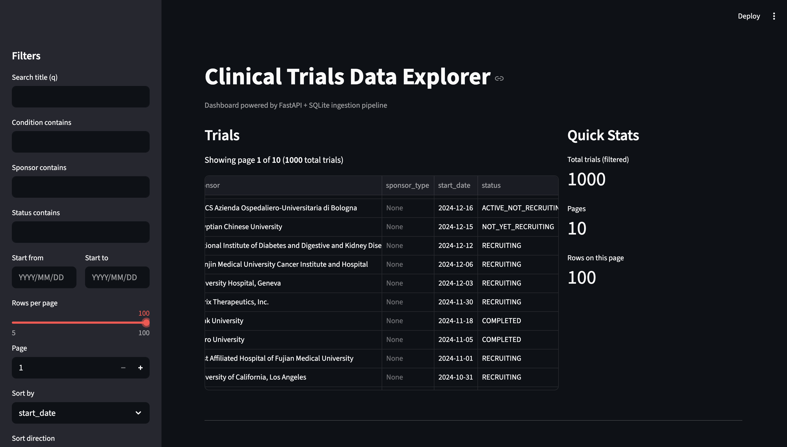

# Clinical Data Explorer

End-to-end Python project: ETL → FastAPI → Analytics → Streamlit Dashboard.

## Overview
This project ingests public clinical trials data, validates and stores it in SQLite,
exposes a FastAPI API with filtering and analytics, and provides a Streamlit dashboard
that consumes the API.

## Screenshot


## Run locally
```bash
docker compose up --build
docker compose exec api python -m scripts.ingest
```

## Repository
Source code available on GitHub.

